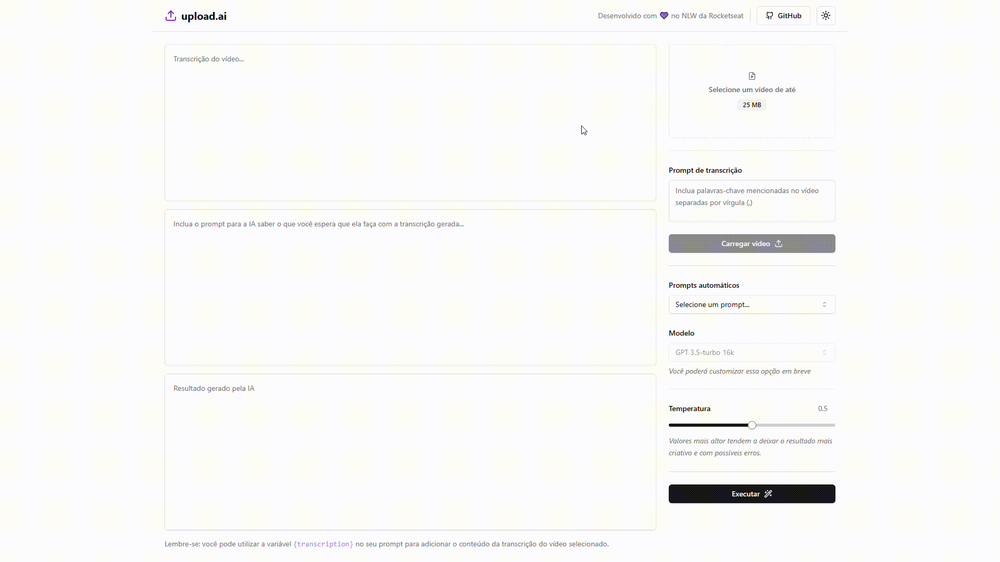

<div align="center" >
  <svg xmlns="http://www.w3.org/2000/svg" width="40" height="40" viewBox="0 0 24 24" fill="none" stroke="#bb00ff" stroke-width="3" stroke-linecap="round" stroke-linejoin="round" class="lucide lucide-upload"><path d="M21 15v4a2 2 0 0 1-2 2H5a2 2 0 0 1-2-2v-4"/><polyline points="17 8 12 3 7 8"/><line x1="12" x2="12" y1="3" y2="15"/></svg> 
  <h1 align="center">Upload.IA Web</h1>
</div>

<p align="center">Projeto desenvolvido na Trilha Mastery da NLW IA da <a href="https://www.rocketseat.com.br/">Rocketseat</b>.</p>

<div align="center">
  <a href="#project">Projeto</a>
  &nbsp;&nbsp;&nbsp;|&nbsp;&nbsp;&nbsp;
  <a href="#technologies">Tecnologias</a>
  &nbsp;&nbsp;&nbsp;|&nbsp;&nbsp;&nbsp;
  <a href="#usage">Utilização</a>
  &nbsp;&nbsp;&nbsp;|&nbsp;&nbsp;&nbsp;
  <a href="#license">Licença</a>
</div>

<h2 id="project">📁 Projeto</h2>

Aplicação que possibilita realizar upload de videos e por meio de IA, criar automaticamente títulos chamativos e descrições com um boa indexação além de outros conteúdos que você solicitar.


<div align="center" style="width: 100%;">
	
</div>

<h2 id="technologies">💻 Tecnologias</h2>

Este projeto foi desenvolvido utilizando tecnologias como:

- React
- Vite
- Tailwind CSS
- TypeScript
- ESLint
- Axios
- FFmpeg
- Shadcn UI

<h2 id="usage">💡 Utilização</h2>

1. Clone o projeto:

    ```sh
    git clone https://github.com/DavidWesley/upload-ia.git --branch main --single-branch
    ```

2. Acesse a pasta do projeto:

    ```sh
    cd upload-ai/web
    ```

3. Instale as dependências:

    ```sh
    npm ci
    ```

4. Inicie a aplicação:

    ```sh
    npm run dev
    ```

<h2 id="license">📝 Licença</h2>
Este projeto está sob a licença [MIT](../LICENSE).